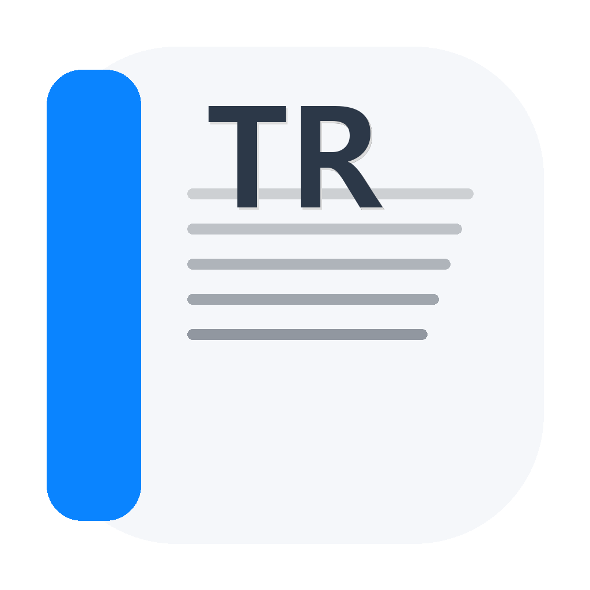
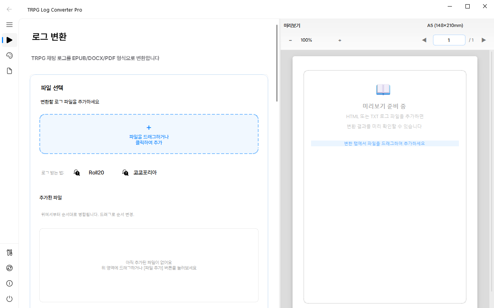
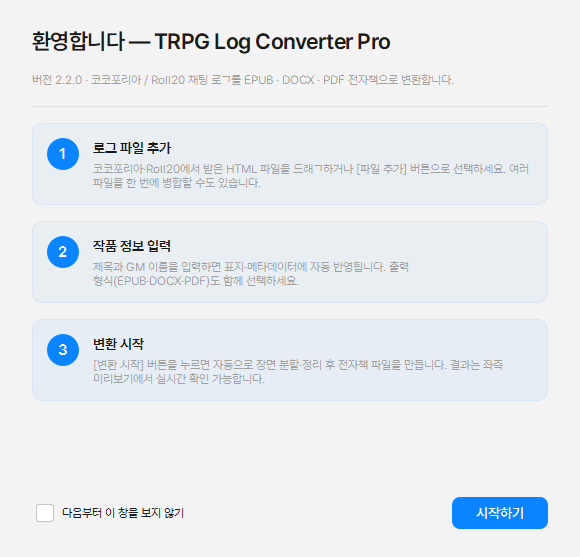

<div align="center">



# TRPG Log Converter Pro

**TRPG 채팅 로그를 한 권의 전자책으로.**

코코포리아·Roll20 세션 로그를 자동으로 정리해 EPUB·DOCX·PDF로 출판합니다.
민음사 희곡 판형부터 가벼운 노벨 스타일까지, 한 번의 클릭으로.

[](https://github.com/ChoYugyeong/trpg-log-converter-pro/releases)
[](LICENSE)
[](#개발자용)
[](#개발자용)

[**⬇ Windows 다운로드**](https://github.com/ChoYugyeong/trpg-log-converter-pro/releases/latest) ·
[**⬇ macOS 다운로드**](https://github.com/ChoYugyeong/trpg-log-converter-pro/releases/latest) ·
[버그 신고](https://github.com/ChoYugyeong/trpg-log-converter-pro/issues)



</div>

---

## 왜 만들었나

플레이어 입장에서 "오늘 세션 진짜 재밌었어" 하고 끝난 캠페인을 한 권의 책으로 남기고 싶을 때,
HTML 채팅 로그를 직접 정리하면 보통 며칠씩 걸립니다. 이 앱은 그 과정을 **5분 이내**로 줄여줍니다.

* 시스템 메시지 / 잡담 채널 / `[main]` 같은 채널 토큰 자동 제거
* `■ 장면 1`, `▶Scene` 같은 마커를 인식해서 자동 챕터 분할
* GM 발화는 나레이션처럼, 캐릭터 대사는 소설풍 인용구로
* 다이스 결과, 효과(이펙트), 이미지까지 모두 보존

## 주요 기능

| 기능 | 설명 |
|---|---|
| **코코포리아 + Roll20 모두 지원** | HTML 한 파일이면 끝. 옛 `firing_name_*` 형식과 모던 `<p class="player pN">` 형식 모두 자동 감지. |
| **EPUB · DOCX · PDF 동시 출력** | 한 번 변환으로 전자책 리더, Word, 인쇄용 PDF 모두 받기. EPUB은 EPUB 3 spec 통과 검증. |
| **자동 장면 분할** | `■ / ▶Scene / 씬 / 장면 / Act` 같은 마커 기본 인식. 정규식으로 커스텀 패턴 추가 가능. |
| **민음사 희곡 프리셋 내장** | "민음사 세계문학전집 희곡 판본" 스타일 — 본명조 + 부크크 고딕 + hanging indent. `Ctrl+I` 로 즉시 적용. |
| **다중 파일 병합** | 시즌 단위 캠페인이면 1부·2부·3부 HTML을 드래그로 순서 조정 후 한 권으로. |
| **자동 업데이트** | 새 버전 나오면 앱이 알려주고 한 번의 클릭으로 설치. 설정은 그대로 보존. |
| **빈손에 가벼움** | Windows 159 MB / 메모리 180 MB. WebEngine 빼고 필수 Qt 모듈만 번들. |

## 빠른 시작 (3분 안에 첫 변환)

<table>
<tr>
<td width="50%" valign="top">

### 1. 다운로드 & 설치

**Windows** — [Setup_2.2.0.exe](https://github.com/ChoYugyeong/trpg-log-converter-pro/releases/latest) 다운로드 → 더블클릭 → 한국어 인스톨러 진행

**macOS** — [macOS.dmg](https://github.com/ChoYugyeong/trpg-log-converter-pro/releases/latest) 다운로드 → 드래그해서 Applications 폴더로

> "확인되지 않은 게시자" 경고가 뜨면: Windows는 `추가 정보 → 실행`, macOS는 우클릭 → 열기

</td>
<td width="50%" valign="top">



</td>
</tr>
</table>

### 2. 로그 받기

- **코코포리아**: 룸 종료 후 자동 다운로드 링크, 또는 룸 메뉴 → 로그 → HTML 저장
- **Roll20**: `app.roll20.net/campaigns/chatarchive/<캠페인ID>` 주소 직접 입력 → `Ctrl+S` 로 HTML 저장
- 앱 안에서 **[Roll20 로그 받는 법]** / **[코코포리아 로그 받는 법]** 버튼이 단계별 가이드를 띄워줍니다.

### 3. 변환

1. HTML을 드래그 → "추가된 파일" 영역으로 떨굼 (또는 [파일 추가] 클릭)
2. 작품 제목 + GM 이름 입력
3. EPUB / DOCX / PDF 중 원하는 형식 체크
4. **[변환 시작]**

끝. `export/` 폴더에 결과가 만들어집니다.

## 출력 예시

| 입력 | 출력 |
|---|---|
| `■ 도입: 미스카토닉 대학` | **제1장: 도입: 미스카토닉 대학** (가운데 정렬 큰 헤딩) |
| `KP: 도서관에 들어섰다.` | _― 도서관에 들어섰다._ (나레이션 들여쓰기) |
| `사사키: 「안녕하세요.」` | **사사키** 「안녕하세요.」 (이름 굵게 + 큰따옴표) |
| `CCB<=65 → 35 성공` | _〈 35 〉 SUCCESS_ (다이스 결과 미니멀 표시) |
| `[잡담] 점심 뭐 먹지` | (자동 필터링) |

## FAQ

<details>
<summary><b>Windows 설치 시 "확인되지 않은 게시자" 경고가 떠요</b></summary>

코드 서명 인증서를 아직 받지 않아 Microsoft SmartScreen이 첫 다운로드를 의심합니다.
`추가 정보 → 실행` 으로 진행하시면 됩니다. v3.x 부터 코드 서명 적용 예정입니다.

</details>

<details>
<summary><b>설정/이력은 어디 저장되나요?</b></summary>

* Windows: `%APPDATA%\TRPG_Converter_Pro\gui_settings.json`
* macOS: `~/Library/Application Support/TRPG_Converter_Pro/`
* Linux: `~/.config/TRPG_Converter_Pro/`

앱을 제거해도 이 폴더는 보존됩니다. 재설치하면 그대로 이어서 사용 가능.

</details>

<details>
<summary><b>크래시가 나면 어떻게 해야 하나요?</b></summary>

자동으로 `crashes/crash_<타임스탬프>.txt` 가 생성됩니다 (위 설정 폴더 안).
파일에는 앱 버전, OS, Python 버전, traceback, 최근 로그 200줄이 포함됩니다.
[이슈 보고](https://github.com/ChoYugyeong/trpg-log-converter-pro/issues) 시 첨부해 주시면 빠르게 해결할 수 있어요.

</details>

<details>
<summary><b>다이스 결과가 본문에 들어가는 게 거슬려요</b></summary>

`파싱 및 콘텐츠 → 콘텐츠 필터 → 주사위 굴림 결과 포함` 체크 해제하세요.
효과(이펙트), 시스템 메시지도 같은 방식으로 끌 수 있습니다.

</details>

<details>
<summary><b>한 캠페인을 여러 HTML 파일로 받았는데 한 권으로 만들고 싶어요</b></summary>

파일을 모두 드래그한 뒤 위에서부터 1부·2부·3부 순서로 정렬(드래그로 순서 변경 가능),
변환 모드를 **"병합"** 으로 선택 후 [변환 시작].

</details>

<details>
<summary><b>커스텀 폰트를 쓰고 싶어요</b></summary>

`고급 설정 → EPUB 폰트` 에 폰트 패밀리명 입력 + `폰트 임베드` 에 `.ttf/.otf` 파일 경로 지정.
민음사 희곡 스타일을 그대로 쓰려면 본명조 / 부크크 고딕 폰트 라이선스 확인 후 사용하세요.

</details>

<details>
<summary><b>"민음사 희곡 스타일" 프리셋은 어떻게 적용?</b></summary>

`Ctrl+I` (설정 가져오기) → `presets/minumsa_drama_style.json` 선택 → 적용.
하나의 프리셋이 색상·폰트·여백·CSS 전부를 정의합니다.

</details>

<details>
<summary><b>업데이트는 어떻게 받나요?</b></summary>

앱 좌측 사이드바의 **[업데이트 확인]** 클릭하면 최신 버전 확인.
새 버전이 있으면 다운로드 → 자동 적용 (설정 보존). 앱 시작 시 자동 체크도 실행됩니다.

</details>

## 시스템 요구사항

- **Windows 10 (1809 / build 17763) 이상** 64-bit
- **macOS 11 Big Sur 이상** (Intel / Apple Silicon 모두 동작)
- 메모리 200 MB, 디스크 200 MB
- 인터넷 — 업데이트 확인용 (오프라인에서도 변환은 정상 동작)

---

## 개발자용

소스에서 빌드하거나 기여하실 분만 보세요.

### 환경 설정

```bash
git clone https://github.com/ChoYugyeong/trpg-log-converter-pro
cd trpg-log-converter-pro
pip install -r requirements.lock         # 런타임만
pip install -r requirements-dev.lock     # 테스트/빌드 도구 포함
```

Python 3.10+ 필요.

### 실행

```bash
python main.py
```

### 테스트

```bash
pytest                  # 375개 단위 + end-to-end 테스트
ruff check core gui     # 린트
mypy core gui           # 타입 체크
```

### 빌드

```bash
python scripts/build.py
```

`dist/TRPG_Converter_Pro/` 에 PyInstaller 번들 + `dist/installer/` 에 Windows EXE 인스톨러.
빌드 후 자동 smoke test (정적 패키지 검증 + 런치 검증) 실행.

### 아키텍처 한눈에

```
main.py              QApplication 부트
core/
  config/            단일 소스 defaults + 마이그레이션 프레임워크
  parsers/           Roll20 / Cocofolia / 텍스트 파서
  renderers/         EPUB / DOCX / PDF 생성기
  services/
    updater.py       GitHub Releases 자동 업데이트
    crash_handler.py 전역 예외 진단 덤프
    logger.py        Rotating + 옵션 JSON 로그
gui/
  pages/             4탭 (홈/서식/파싱/고급)
  dialogs/           About / Update / Welcome
  components/        DocumentPreview, FileDropArea 등
tests/               375 tests, 71% coverage
```

자세한 내부 구조는 각 `__init__.py` 의 docstring을 참고.

### 기여

PR 환영합니다. 새 기능은 가능하면 테스트 동반.

1. 새 브랜치
2. 변경 + 테스트
3. `pre-commit run --all-files`
4. PR

### 라이선스

MIT — [LICENSE](LICENSE)
